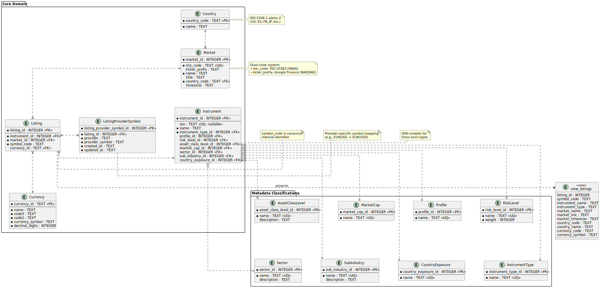

# Symb0l Core

> **Note**: The name `Symb0l` should always be written in monospace font with a slashed zero (Ø) to distinguish it from the letter O.

`Symb0l` is a lightweight financial instrument and symbol database management system built with Node.js and SQLite. It provides a structured schema for normalizing and storing data related to exchanges, markets, instruments, listings, and currencies.

## Features

- **SQLite Database**: Uses `node:sqlite` (Node.js built-in module) for fast and reliable local data storage. Although `node:sqlite` is still somewhat immature, this design decision was made to eliminate third-party dependencies and bet on native Node.js support.
- **Normalized Schema**:
  - `exchange`: Stores exchange details.
  - `market`: Represents markets within exchanges.
  - `instrument`: Base definition of financial instruments (ISIN, name, type).
  - `listing`: Links instruments to markets with specific symbols and tickers.
  - `currency`: Reference table for currencies.
- **TypeScript**: Written in TypeScript for type safety and modern tooling.

## Data Model



## Prerequisites

- Node.js (managed via mise)
- pnpm (managed via mise)
- [mise](https://mise.jdx.dev/) (optional, for environment management)

## Installation

Using `mise` to install the correct Node.js and pnpm versions:

```bash
mise install
pnpm install
```

If not using `mise`, ensure you have Node.js and pnpm installed manually.

## Usage

### Development

To start the application in development mode with hot-reloading:

```bash
pnpm dev
```

### Production

To build and start the application:

```bash
pnpm build
pnpm start
```

## Project Structure

- `src/index.ts`: Entry point of the application.
- `src/db.ts`: Database connection and schema initialization.
- `src/db.test.ts`: Database unit tests.
- `src/index.test.ts`: Application entry point tests.
- `symb0l.db`: SQLite database file (created on first run).

## Documentation

- [Database Management](doc/DATABASE.md) - Schema, seeds, and development workflow
- [Testing Guide](doc/TESTING.md) - Unit and integration testing

## Testing

This project uses Node.js 24's native test runner (`node:test`) for zero-dependency testing.

### Run all tests

```bash
mise exec -- pnpm test
```

### Run tests in watch mode

Automatically re-run tests when files change:

```bash
mise exec -- pnpm test:watch
```

### Generate test coverage

```bash
mise exec -- pnpm test:coverage
```

**Test Coverage:**

- Database initialization and schema creation
- UNIQUE, FOREIGN KEY, and NOT NULL constraints
- Idempotent initialization
- Complete data hierarchy relationships
- Application startup verification

## Pre-commit Hooks

This project uses [lefthook](https://github.com/evilmartians/lefthook) for automated pre-commit checks.

### Automatic Setup

Hooks are automatically installed when you run `pnpm install` (via the `prepare` script).

### What Runs on Commit

Before each commit, the following checks run in parallel:

- **Type checking:** `tsc --noEmit` - Catches TypeScript errors
- **Tests:** `pnpm test` - Ensures all tests pass

### Local Overrides

Create a `lefthook-local.yml` file (gitignored) for local hook customizations.

## GitHub Game


